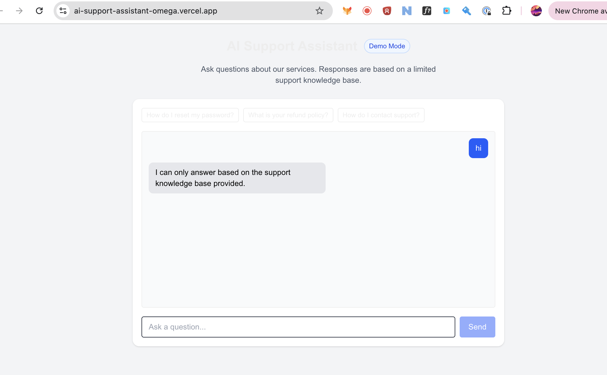

# AI Support Assistant

A small full-stack support chatbot built with Next.js. It answers common customer support questions using either OpenAI or a local mock AI mode backed by a knowledge base.

**Live demo:** https://ai-support-assistant-omega.vercel.app/

## Screenshot



## Features

- Chat interface with example support questions
- Server-side API route for AI responses
- OpenAI integration for real AI answers
- Demo mode fallback for public deployments without API tokens
- Local knowledge base for safe, grounded support responses
- Loading state and disabled input while a response is being generated
- Clear chat button
- Graceful fallback message when a response cannot be generated

## Tech Stack

- Next.js App Router
- React
- TypeScript
- Tailwind CSS
- OpenAI Node SDK
- Vitest
- React Testing Library
- Vercel

## Demo Mode

This project supports a mock AI mode for safe public deployment.

When `USE_MOCK_AI=true`, the API route does not call OpenAI. It returns a conversational response using the local knowledge base instead.

When `USE_MOCK_AI=false`, the app uses the existing OpenAI integration. If OpenAI fails, the API falls back to the local knowledge base so the demo still works.

## Run Locally

Install dependencies:

```bash
npm install
```

Create a local environment file:

```bash
cp .env.example .env.local
```

Run the development server:

```bash
npm run dev
```

Open http://localhost:3000 in your browser.

## Environment Variables

For public demo mode:

```env
USE_MOCK_AI=true
```

For real OpenAI responses:

```env
USE_MOCK_AI=false
OPENAI_API_KEY=your_api_key_here
```

Do not commit real API keys. Keep secrets in `.env.local` locally or in Vercel Environment Variables in production.

## CI/CD

The project is deployed with Vercel.

- Pushes to the production branch trigger a production deployment
- Pull requests create preview deployments
- Vercel installs dependencies and runs `npm run build`
- Failed builds do not replace the current live deployment
- Environment variables are configured in the Vercel dashboard

## Testing

Run the test suite:

```bash
npm test
```

Run lint and production build checks:

```bash
npm run lint
npm run build
```

## What I Learned

- How to build an App Router API route for a chat workflow
- How to keep API keys server-side and out of the browser
- How to add a production-safe demo mode for public portfolio projects
- How to design graceful fallbacks when a third-party API is unavailable
- How to test basic user interaction with Vitest and React Testing Library

## Future Improvements

- Add more knowledge base categories
- Improve semantic matching in demo mode
- Add streaming responses for real OpenAI mode
- Add richer empty, loading, and error states
- Persist chat history locally for the current browser session

## Live Demo
https://your-app.vercel.app

## Repository
https://github.com/yourname/project